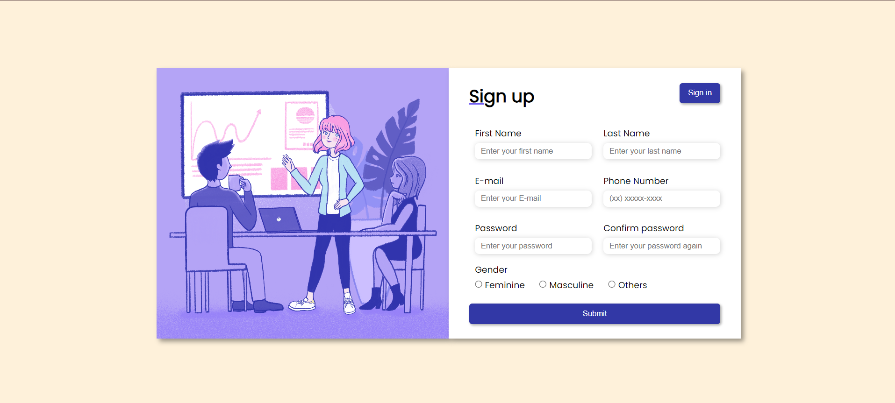

# Responsive Registration Form

This repository features a registration form created with HTML, CSS, and JavaScript. The form includes input validation, ensuring all fields are filled in correctly before submission. It uses regular expressions for email and phone number validation and checks password length and confirmation. The form is fully responsive, making it accessible across various device sizes.



## Installation

To get started with this project:

1. Clone the repository to your local machine:
   ```bash
   git clone https://github.com/belacartaxo/registration-form.git
2. Navigate to the project directory:
   ```bash
   cd registration-form
3. Open the index.html file in your preferred web browser to run the form.

## Usage
To use the registration form:
1. Fill in all the fields: first name, last name, email, phone number, password, confirm password, and select gender.
2. The form will display real-time validation errors if any input is invalid (e.g., incorrect email format, short passwords, unmatched passwords, etc.).
3. Once all fields are valid, you can submit the form.

## Features
- Input Validation: JavaScript is used to validate fields such as email, phone number, password strength, and confirmation.
- Responsive Design: The form adapts to different screen sizes, making it usable on mobile, tablet, and desktop devices.
- Regular Expressions: Custom regular expressions are used to validate email and phone number formats.
- User Feedback: The form provides immediate feedback on invalid inputs using custom error messages.

## Code Overview
The JavaScript code handles the following:
- Real-time Validation: Each input field is validated as the user types, checking for length, format, and empty values.
- Regex Validation: Uses regex patterns to validate email and phone number formats.
- Form Submission: The form only submits when all fields are correctly filled out, preventing incomplete or incorrect submissions.

## Author
This repository is maintained by Your [Isabela Cartaxo](https://github.com/belacartaxo).
